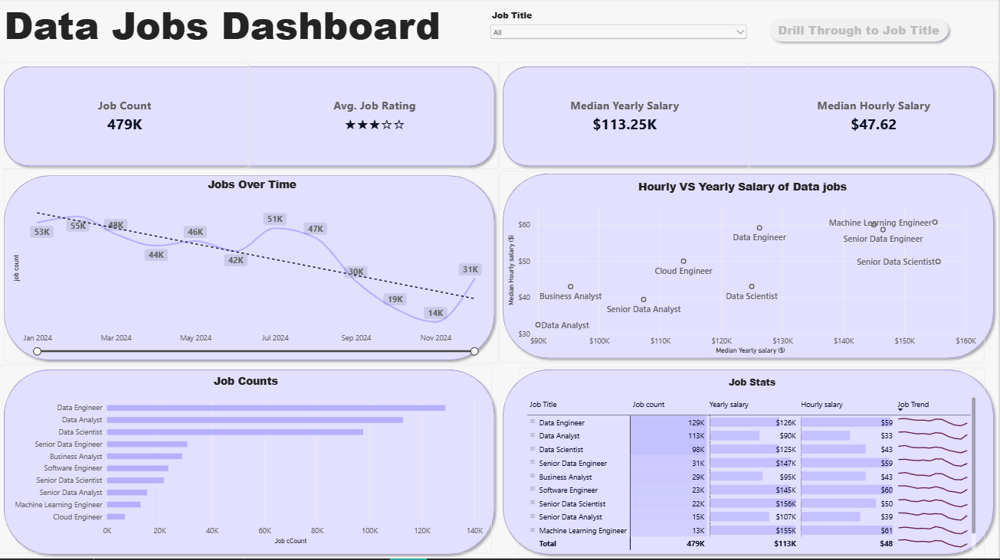
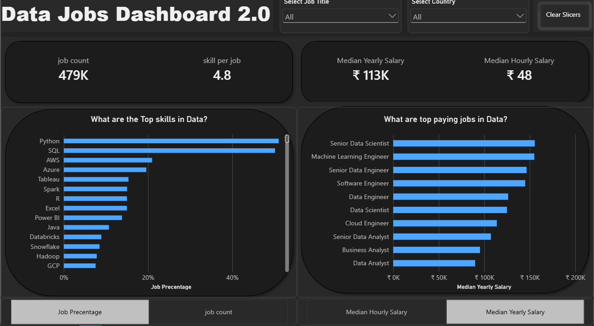

# 📊 Power BI Data Analytics Projects

This repository contains the **Power BI projects I built while developing my data analytics skills**.

Through these projects, I explored the data job market, analyzed salary trends and in-demand skills, and created interactive dashboards using Power BI.

## 🎯 Projects

### 📌 Project 1: Data Jobs Dashboard

An interactive Power BI dashboard designed to explore the data job market, analyze salary trends, and understand job opportunities across different roles and locations.

**Key Features:**
- 📊 Job market overview
- 💰 Salary analysis
- 📍 Location-based analysis
- 📈 Job and salary visualizations
- 🎛️ Interactive filtering
- 🔎 Job title drill-through analysis

📁 [Explore Project 1](https://github.com/Akhil-Shaji-bOt/PowerBi-Dashboard/tree/main/Data_Jobs_v1)

### 📌 Project 2: Data Jobs Dashboard 2.0

A single-page Power BI dashboard focused on analyzing key job market metrics, in-demand skills, and salary insights.

**Key Features:**
- 📌 KPI cards for key metrics
- 💼 Job count and salary analysis
- 🧠 In-demand skills analysis
- 💰 Highest-paying data roles
- 🌎 Country-based filtering
- 🎛️ Interactive slicers
- 🧮 DAX measures
- ⭐ Star schema data modeling

📁 [Explore Project 2](https://github.com/Akhil-Shaji-bOt/PowerBi-Dashboard/tree/main/Data_Jobs_v2)

## 🛠️ Skills & Tools

Throughout these projects, I practiced and applied:

- **Power BI**
- **Power Query**
- **DAX**
- **Data Cleaning & Transformation**
- **Data Modeling**
- **Star Schema**
- **Data Visualization**
- **Interactive Dashboards**
- **KPI & Measure Creation**
- **Data Analysis**

## 📚 Learning Context

These projects were developed as part of my learning journey with **Luke Barousse's Power BI for Data Analytics course**.

I used the course as a foundation to practice data transformation, data modeling, DAX, and visualization while building my own dashboards.

## 🚀 What I Learned

Working on these projects helped me gain practical experience in transforming raw job-posting data into meaningful insights.

I developed my understanding of **Power Query, DAX, data modeling, dashboard design, and interactive reporting**, while exploring real-world-style data analytics problems.

